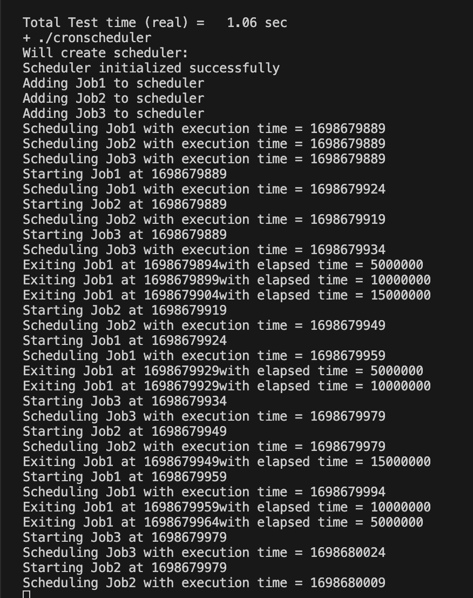

# Cron Scheduler: 

## Description:
This project implements a simple cron scheduler which can accept a set of jobs and schedules them periodically based on specififed frequency.

## Technical decisions:
You can find below some of the main technical decisions/patterns followed in this implementation and the reasonong for each. For the chron scheduler I decided to follow the singleton design patter for the scheduler implementation and opted for using a threadpool. 

### Singleton design pattern:
The CronScheduler class uses the singleton design pattern to ensure that only one instance of the class is created and used throughout the execution. At any point in time, there should only be one instance of the scheduler to avoid conflicts or synchronization issues that might arise. The GetInstance() function returns a pointer to the singleton instance of the CronScheduler class, and if the instance does not exist, it creates a new one and initializes it.

### Threadpool usage:
The CronScheduler class utlizes a threadpool from boost library. The threadpool allows us to execute jobs concurrently and improve performance. A threadpool is able to improve performance where the thread pools are created once and are then reused throughout the application execution. This removes the overhead of spawning/instatiating and destorying a thread for each job run.

### Priority Queue
The CronScheduler utilizes a priority queue which is known to have insertion time of O(log(n)) and peek of O(1). The jobs in the queue are sorted with jobs with earliest execution time having highest priority. With that implementation, the scheduler only needs to check job at top of queue for execution. 

## Snippet:

## Fututre Improvements:

### Validity check: 
Should modify AddJob function in scheduler to perform some validty checks before adding it. 

### Extend functionality
Need to be able to add jobs at runtime and extend scheduler functionality to perform further operations like editing, canceling and specifying job start time.

### Pass by reference
Throughout my code I'm passing all objects by value where a copy of the object is created. This can be inefficient especially when objects grow in size. Code can be further midified to pass objecs by reference and improve performance.

### Error handling 
Need to add error handling in case a job throws an exception or fails.

### Thread safety 
Need to ensure thread safety in case jobs access same resources.

### Stress testing 
Need to perform some sort of stress testing to be able to identify performance bottlenecks and look for ways to further improve the scheduler. Stress test will also allow us to find out number of jobs the scheduler is able to handle which is beneficial for production purposes.

### Higher precision
Use high precision clock to calculate elapsed time.

## Functions:

### CronScheduler* CronScheduler::GetInstance()
This function returns a pointer to the singleton instance of the CronScheduler class. If the instance does not exist, it creates one and initializes it.

### void CronScheduler::AddJob(CronJob job)
This function adds a new CronJob object to the m_jobs vector.

### void CronScheduler::ScheduleJob(CronJob job)
This function adds a new CronJob object to the m_queue priority queue.

### CronJob CronScheduler::GetHighestPriorityJob()
This function returns the topmost CronJob object from the m_queue priority queue and removes it from the queue.

### std::chrono::time_point<std::chrono::system_clock>  CronScheduler::GetNextExecutionTimePoint ()
This function returns the execution time of the top most CronJob object in the m_queue priority queue.

### void CronScheduler::Run()
This function runs an infinite loop that continuously checks if there are any jobs in the queue that need to be executed. If there are, it executes them using a thread pool. If not, it waits until the next job is scheduled.

### CronJob(std::string identifier, std::function<void()> function, std::chrono::time_point<std::chrono::system_clock> excutionTime, std::chrono::seconds interval, std::chrono::seconds frequency)
This constructor initializes a new CronJob object with an identifier, a function to execute, an execution time, an interval between executions, and a frequency of execution.

## To run: 
Run run_scheduler script